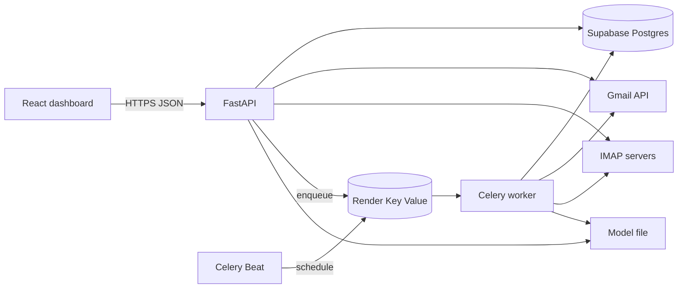

# Email Classifier

Sort mail from Gmail or IMAP into Payment, Spam, Promotions, and General. Keyword rules run first. A TF-IDF + logistic regression model classifies whatever the rules do not catch.

## Architecture



The browser talks only to the API. OAuth tokens and IMAP passwords are encrypted before they are written to Supabase. Celery Beat asks Redis to run a sync every few minutes. Workers fetch new mail, apply rules, then the model, and store the category on each message.

## Tech stack

| Layer | Choice |
| --- | --- |
| API | Python 3.12, FastAPI, Uvicorn |
| UI | React 18, TypeScript, Vite |
| Database | Supabase Postgres |
| Queue | Celery 5, Redis (Render Key Value) |
| Mail | Gmail API with OAuth 2.0, IMAP fallback |
| Model | scikit-learn TF-IDF + logistic regression |
| Runtime | Render for the API and workers |

## Folder structure

```text
email_classifier/
  schema.sql                 Run once in the Supabase SQL Editor
  render.yaml                Render API, workers, and Redis
  docker-compose.yml         Optional local API and Redis
  .env.example
  backend/
    app/
      main.py                FastAPI app
      api/                   /auth, /fetch-emails, /filter-emails, /get-categories
      services/              Gmail, IMAP, rules, classifier
      workers/               Celery app and periodic tasks
      db/                    SQLAlchemy models and seed data
    tests/
  frontend/                  React dashboard
  infra/k8s/                 Kubernetes manifests
  .github/workflows/ci.yml
```

## API

| Method | Path | Purpose |
| --- | --- | --- |
| GET | `/auth` | Current user and connected accounts |
| POST | `/auth/dev` | Demo login when `DEV_MODE=true` |
| GET | `/auth/google` | Start Gmail OAuth |
| GET | `/auth/google/callback` | Store tokens and return to the UI |
| POST | `/auth/imap` | Save an IMAP account |
| GET | `/auth/export` | Download stored mail (GDPR access) |
| DELETE | `/auth/account` | Erase the user and their mail |
| POST | `/fetch-emails` | Pull recent mail and classify it |
| POST | `/filter-emails` | Re-run rules and the model |
| POST | `/filter-emails/train` | Fit the model on labeled mail |
| GET | `/get-categories` | Categories with counts |
| GET | `/emails` | List mail, with `category` and `q` |
| PATCH | `/emails/{id}` | Manual label, used as training data |
| POST | `/emails/import` | Insert messages without a mailbox |
| POST | `/rules` | Add a private keyword rule |

## Run locally

```bash
python -c "from cryptography.fernet import Fernet; print(Fernet.generate_key().decode())"
```

Copy `.env.example` to `.env`. Set `DATABASE_URL` to the Supabase session-pooler URI, plus `JWT_SECRET` and `ENCRYPTION_KEY`. Then:

```bash
cd backend
pip install -r requirements-dev.txt
uvicorn app.main:app --reload
```

In another terminal, from `frontend/`, run `npm install` and `npm run dev`. Open `http://localhost:5173`. The dashboard calls the deployed API at `https://email-classifier-5puo.onrender.com` (`frontend/.env.development`). Use the demo account and **Load samples** to see classification without connecting a mailbox. New rows show up in the Supabase Table Editor.

Docker Compose runs the API, workers, and local Redis against that same Supabase URL:

```bash
docker compose up --build
```

On Windows, start the worker with `--pool=solo`:

```bash
celery -A app.workers.celery_app worker --loglevel=info --pool=solo
celery -A app.workers.celery_app beat --loglevel=info
```

### Gmail OAuth

1. Create an OAuth client in Google Cloud (web application).
2. Enable the Gmail API.
3. Add the redirect URI `http://localhost:8000/auth/google/callback`.
4. Put the client id and secret in `.env`.
5. The requested scope is `gmail.readonly`.

## Classification

Global rules ship in `backend/app/db/seed.py`. A higher `priority` wins. Spam rules outrank payment and promotions. If nothing matches, the active scikit-learn pipeline predicts a label. With no model yet, the message stays in General.

Manual labels (`PATCH /emails/{id}`) are kept when mail is reclassified. Training needs at least eight labeled messages and two categories. The artifact is written to `models/classifier.joblib`.

## Database

Supabase hosts the Postgres database. `schema.sql` defines Users, OAuth credentials, IMAP accounts, Categories, Emails, Rules, and model versions. Run that file once in the Supabase SQL Editor. On startup the API creates any missing tables and seeds the four categories.

## Workers

`backend/app/workers/celery_app.py` schedules:

- inbox sync every `FETCH_INTERVAL_SECONDS` (default 300)
- deletion of messages older than `RETENTION_DAYS` (default 365) once a day

The worker and the API share the model volume so a trained pipeline is visible to both.

## Supabase setup

1. Create a project at [supabase.com](https://supabase.com). Save the database password.
2. Open **SQL Editor**, paste the contents of `schema.sql`, and run it. **Table Editor** should list `users`, `emails`, `categories`, `rules`, `oauth_credentials`, `imap_accounts`, and `classification_models`.
3. Open **Project Settings → Database → Connection string**.
4. Choose **Session pooler** and copy the URI. It uses port **5432** on `pooler.supabase.com`. Render is IPv4-only, so use this pooler string. The direct host `db.<ref>.supabase.co` often fails there, and port **6543** (transaction mode) breaks SQLAlchemy.
5. If the password contains `@`, `#`, `%`, or `/`, URL-encode it before pasting the URI into `DATABASE_URL`.
6. Leave **Database → Network restrictions** empty unless you have a reason to lock them. A restriction must include Render’s outbound addresses or the API cannot connect.

The API adds `sslmode=require` when the host is Supabase. You can paste the URI exactly as Supabase shows it.

## Render setup

`render.yaml` defines four services: the API, a Celery worker, Celery beat, and a Key Value store used as Redis.

1. Push this repo to GitHub.
2. In the Render dashboard choose **New → Blueprint** and select the repo. Render reads `render.yaml`.
3. When prompted, set:
   - `DATABASE_URL` to the Supabase session-pooler URI.
   - `ENCRYPTION_KEY` to a Fernet key: `python -c "from cryptography.fernet import Fernet; print(Fernet.generate_key().decode())"`
   - `GOOGLE_CLIENT_ID` and `GOOGLE_CLIENT_SECRET` from Google Cloud. Leave them empty until Gmail is ready.
   - `FRONTEND_URL` to the site that will call the API, for example `http://localhost:5173` or your deployed frontend origin.
   - `GOOGLE_REDIRECT_URI` to `https://<your-api>.onrender.com/auth/google/callback`. Copy the API hostname after the first deploy, set this value, then redeploy.
4. Add that same redirect URI to the Google OAuth client. The Gmail API must be enabled, and the scope stays `gmail.readonly`.
5. Open `https://<your-api>.onrender.com/health`. A healthy service returns `{"status":"ok"}`. The first request also creates any missing tables and seeds Payment, Spam, Promotions, and General.
6. In Supabase **Table Editor**, open `categories`. The four rows appear after that first boot.

`JWT_SECRET` is generated by Render. `DEV_MODE` is `false` on Render, so `/auth/dev` is disabled. The free web service sleeps after idle time and wakes on the next request. The worker and beat services are on the starter plan so inbox sync keeps running. Without those two workers, **Fetch mail** in the dashboard still classifies on demand.

A trained model file lives on the service disk and is cleared on each deploy. Add a Render disk mounted at `/var/data` and set `MODEL_PATH=/var/data/classifier.joblib` if the model must survive deploys.

Local Redis for workers is still available with Docker Compose. The database in that setup is the Supabase URL in `.env`, not a local Postgres container.

## Security and privacy

- Gmail access is OAuth 2.0 with the read-only Gmail scope. The app does not ask for permission to send or delete mail.
- Access tokens, refresh tokens, and IMAP passwords are encrypted with Fernet before storage. The key stays in the environment, not in the database.
- API calls use a bearer JWT. Set a long random `JWT_SECRET` outside demo mode.
- Message bodies are truncated, and only a few headers are stored.
- `GET /auth/export` and `DELETE /auth/account` cover access and erasure. The daily purge enforces a retention window.
- Put the API behind HTTPS in any shared environment. Turn `DEV_MODE` off there so the demo login route is gone and a missing encryption key fails startup.
- The OAuth callback currently redirects to the frontend with the session token in the query string. That is enough for local development. For production, exchange a one-time code stored in Redis and set the session in an HttpOnly cookie.
